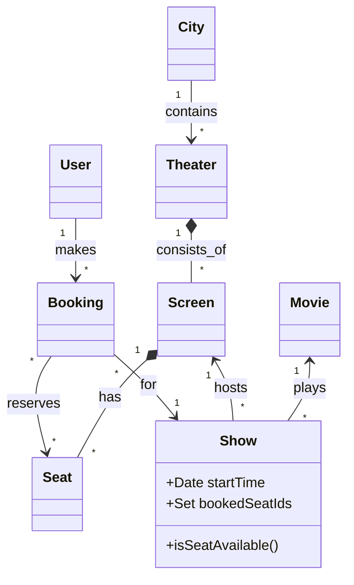

---
# Low-Level Design (LLD) for BookMyShow, tailored for an interview setting (approx. 1 hour implementation).
---
### 1) Functional and Non-functional Requirements

| Type | Requirement | Description |
| --- | --- | --- |
| **Functional** | **Search** | Search movies by City. |
|  | **Catalog** | View Theaters and Shows for a specific movie. |
|  | **Booking** | Select seats and book a ticket. |
|  | **Concurrency** | Handle multiple users trying to book the same seat simultaneously. |
| **Non-Functional** | **Consistency** | **Critical.** Double booking of seats must never happen. |
|  | **Availability** | Browsing movies should be highly available; Booking can sacrifice availability for consistency. |

---

### 2) Rough Flow of Program

1. **Admin Setup:** Create City -> Theater -> Screen -> Seats -> Movies -> Create Shows.
2. **User Search:** User selects City -> Sees Movies -> Selects Movie -> Sees Shows.
3. **Booking:** User selects Show -> Sees available Seats -> Selects Seats.
4. **Transaction:** System validates seat availability -> Locks Seats -> Confirms Booking.

---

### 3) Entities, Class Diagram & MVC Data Flow

**Core Entities:**

* `City`, `Theater`, `Screen`, `Seat`
* `Movie`, `Show` (Links Movie + Screen + Time)
* `Booking`


## A) UML Class Diagram (Structure & Relations)

This diagram represents the **static structure** of the BookMyShow system and shows how core entities like `City`, `Theater`, `Screen`, `Show`, and `Booking` relate to each other.



---

### B) Visual Execution Flow

```text
[Client]
   |  (1) HTTP POST /book
   v
[Controller]
   |  (2) validate input -> call service
   v
[Service]
   |  (3) getShow(id)
   |  (4) checkSeatAvailability() -> error if booked
   |  (5) Lock Seats (synchronized)
   |  (6) createBookingObject()
   v
[Repository]
   |  (7) save(booking)
   |  (8) update(show)
   v
[Database / In-Memory]
```

---

### 4) Relations (OOPS & SOLID Principles)

| Relationship | Entities | Logic |
| --- | --- | --- |
| **Composition** | Theater \leftrightarrow Screen | A screen cannot exist without a Theater. |
| **Aggregation** | City \leftrightarrow Theater | Theaters exist within a city. |
| **Association** | Show \rightarrow Movie | A show plays a specific movie. |
| **Many-to-One** | Booking \rightarrow Show | Multiple bookings belong to one show. |

---

### 5) Design Patterns

| Pattern | Where used? | Why? |
| --- | --- | --- |
| **Singleton** | `Repositories` | via Spring `@Repository`. Ensures single source of truth for data. |
| **Strategy** | `PaymentService` | (Optional) To switch between CreditCard, UPI, etc. |
| **Optimistic Locking** | `BookingService` | To handle concurrent seat selection. |

---

### 6) Database & In-Memory Design

**In-Memory Implementation:**
I will use `ConcurrentHashMap<Long, Entity>` to simulate tables. It is thread-safe and allows O(1) retrieval.

**Database Selection (If Real DB):**

| DB Type | Choice | Reason |
| --- | --- | --- |
| **RDBMS** | **PostgreSQL / MySQL** | **ACID Compliance is mandatory.** Booking seats is a transaction. We need row-level locking to prevent double bookings. |
| **NoSQL** | MongoDB | Only for Movie Metadata (Catalog) which is read-heavy and unstructured. Not for bookings. |

---

### 7) Architecture

**Style:** Layered MVC (Model-View-Controller)
**Framework:** Java Spring Boot

---

### 8) Important Dependencies

| Dependency | Why? |
| --- | --- |
| `spring-boot-starter-web` | Provides Dependency Injection (IoC) and application context. |
| `lombok` | Reduces boilerplate (Getters, Setters, Builders) to keep code clean during the interview. |

---

### 9) Code Implementation

#### **A. Entities**

```java

// 1. Enums

public enum SeatCategory { SILVER, GOLD, PLATINUM }
public enum BookingStatus { CREATED, CONFIRMED, FAILED }

// 2. Base Entity (for ID management)

@Data
public abstract class BaseEntity {
    private Long id;
}

// 3. Models


@EqualsAndHashCode(callSuper = true)
@Data @Builder
public class City extends BaseEntity {
    private String name;
    private List<Theater> theaters;
}

@EqualsAndHashCode(callSuper = true)
@Data @Builder
public class Theater extends BaseEntity {
    private String name;
    private City city;
    private List<Screen> screens;
}

@EqualsAndHashCode(callSuper = true)
@Data @Builder
public class Screen extends BaseEntity {
    private String name;
    private Theater theater;
    private List<Seat> seats;
}

@EqualsAndHashCode(callSuper = true)
@Data @Builder
public class Seat extends BaseEntity {
    private String seatNo;
    private SeatCategory category;
    private double price;
}

@EqualsAndHashCode(callSuper = true)
@Data @Builder
public class Movie extends BaseEntity {
    private String title;
    private int durationMins;
}

@EqualsAndHashCode(callSuper = true)
@Data @Builder
public class Show extends BaseEntity {
    private Movie movie;
    private Screen screen;
    private Date startTime;
    // Critical: Track booked seats for this specific show
    private Set<Long> bookedSeatIds; 
}

@EqualsAndHashCode(callSuper = true)
@Data @Builder
public class Booking extends BaseEntity {
    private Show show;
    private List<Seat> seats;
    private String user;
    private double amount;
    private BookingStatus status;
}

```

#### **B. DTO**

```java


@Data
public class BookingRequest {
    private Long showId;
    private List<Long> seatIds;
    private String userId;
}

```

#### **C. Repositories (In-Memory)**

```java

// Generic Parent for Code Reusability
public abstract class InMemoryRepo<T extends BaseEntity> {
    protected Map<Long, T> map = new ConcurrentHashMap<>();
    protected AtomicLong counter = new AtomicLong(1);

    public T save(T entity) {
        if (entity.getId() == null) entity.setId(counter.getAndIncrement());
        map.put(entity.getId(), entity);
        return entity;
    }
    public T findById(Long id) { return map.get(id); }
    public List<T> findAll() { return new ArrayList<>(map.values()); }
}

@Repository public class CityRepo extends InMemoryRepo<com.bms.model.City> {}
@Repository public class TheaterRepo extends InMemoryRepo<com.bms.model.Theater> {}
@Repository public class MovieRepo extends InMemoryRepo<com.bms.model.Movie> {}
@Repository public class ShowRepo extends InMemoryRepo<com.bms.model.Show> {}
@Repository public class SeatRepo extends InMemoryRepo<com.bms.model.Seat> {}
@Repository public class BookingRepo extends InMemoryRepo<com.bms.model.Booking> {}

```

#### **D. Service (Business Logic)**

```java


@Service
public class BookingService {
    @Autowired private BookingRepo bookingRepo;
    @Autowired private ShowRepo showRepo;
    @Autowired private SeatRepo seatRepo;

    // SYNCHRONIZED: The simplest way to handle concurrency in an interview (on a single machine)
    public synchronized Booking createBooking(Long showId, List<Long> seatIds, String userId) {
        Show show = showRepo.findById(showId);
        if (show == null) throw new RuntimeException("Show not found");

        // 1. Check Availability
        Set<Long> booked = show.getBookedSeatIds();
        for (Long id : seatIds) {
            if (booked.contains(id)) {
                throw new RuntimeException("Seat " + id + " is already booked!");
            }
        }

        // 2. Lock Seats
        booked.addAll(seatIds);
        showRepo.save(show); // Update show state

        // 3. Calculate Price & Create Booking
        List<Seat> seats = new ArrayList<>();
        double total = 0;
        for (Long id : seatIds) {
            Seat s = seatRepo.findById(id);
            seats.add(s);
            total += s.getPrice();
        }

        Booking booking = Booking.builder()
                .show(show)
                .seats(seats)
                .user(userId)
                .amount(total)
                .status(BookingStatus.CONFIRMED)
                .build();

        return bookingRepo.save(booking);
    }
}

```

#### **E. Controller**

```java


@Controller
public class BMSController {
    @Autowired private BookingService bookingService;

    public Booking bookTicket(Long showId, List<Long> seatIds, String user) {
        return bookingService.createBooking(showId, seatIds, user);
    }
}

```

#### **F. Main Class (Simulation Demo)**

```java


@SpringBootApplication
public class BMSApplication {

    public static void main(String[] args) {
        ConfigurableApplicationContext context = SpringApplication.run(BMSApplication.class, args);
        
        // 1. Setup Data
        setupData(context);

        // 2. Get Controller
        BMSController controller = context.getBean(BMSController.class);

        // 3. Run Simulation
        System.out.println("\n--- SIMULATION START ---");

        // Case A: User 1 books Seat 1 & 2
        try {
            System.out.println("User 1 booking seats 1, 2...");
            Booking b1 = controller.bookTicket(1L, Arrays.asList(1L, 2L), "User1");
            System.out.println("User 1 Success. Booking ID: " + b1.getId());
        } catch (Exception e) {
            System.out.println("User 1 Failed: " + e.getMessage());
        }

        // Case B: User 2 tries to book Seat 2 (overlap) & 3
        try {
            System.out.println("\nUser 2 booking seats 2, 3...");
            Booking b2 = controller.bookTicket(1L, Arrays.asList(2L, 3L), "User2");
            System.out.println("User 2 Success. Booking ID: " + b2.getId());
        } catch (Exception e) {
            System.out.println("User 2 Failed: " + e.getMessage());
        }

        System.out.println("--- SIMULATION END ---");
    }

    private static void setupData(ConfigurableApplicationContext ctx) {
        CityRepo cityRepo = ctx.getBean(CityRepo.class);
        TheaterRepo theaterRepo = ctx.getBean(TheaterRepo.class);
        SeatRepo seatRepo = ctx.getBean(SeatRepo.class);
        ShowRepo showRepo = ctx.getBean(ShowRepo.class);

        // Create 10 Seats
        List<Seat> seats = new ArrayList<>();
        for(int i=1; i<=10; i++) {
            seats.add(seatRepo.save(Seat.builder().seatNo("A"+i).category(SeatCategory.GOLD).price(100).build()));
        }

        Screen screen = Screen.builder().name("Screen 1").seats(seats).build();
        City city = cityRepo.save(City.builder().name("NYC").build());
        
        Theater theater = theaterRepo.save(Theater.builder()
                .name("IMAX").city(city).screens(Collections.singletonList(screen)).build());

        // Create Show (ID=1)
        showRepo.save(Show.builder()
                .screen(screen)
                .startTime(new Date())
                .bookedSeatIds(new HashSet<>()) // Important Init
                .build());
                
        System.out.println("System Initialized: Show ID 1 created with 10 seats.");
    }
}

```

---

### 10) Optimization Ideas

| Idea | Description |
| --- | --- |
| **Distributed Locking** | `synchronized` only works on one server. In production, use **Redis (Redlock)** or DB `SELECT ... FOR UPDATE` to lock rows during booking. |
| **Caching** | Cache `City`, `Theater`, and `Movie` data in Redis as they rarely change (Read-heavy). |
| **Indexing** | Add DB indexes on `city_id` (in Theater table) and `movie_id` (in Show table) for faster searching. |
