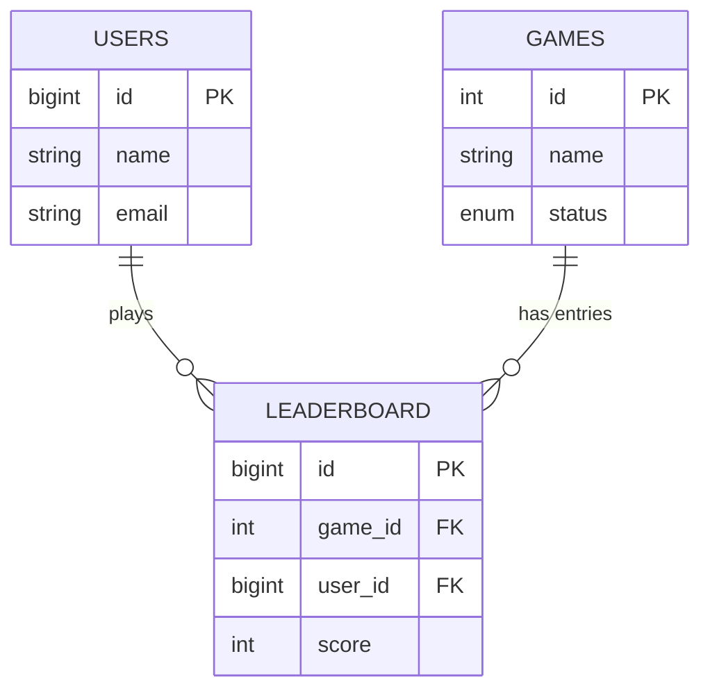

---
# MySQL-based Database Design for a Game Leaderboard
---

### 1) Entities / Tables Design

We will normalize the data into three main tables.

| Table Name | Column Name | Data Type | Constraints / Notes |
| --- | --- | --- | --- |
| **Users** | `id` | `BIGINT` | **PK**, Auto Increment |
|  | `name` | `VARCHAR(100)` | Not Null |
|  | `email` | `VARCHAR(150)` | **Unique**, Index |
|  | `phone` | `VARCHAR(20)` |  |
| **Games** | `id` | `INT` | **PK**, Auto Increment |
|  | `name` | `VARCHAR(100)` | e.g., "PubG Season 1" |
|  | `start_time` | `DATETIME` |  |
|  | `status` | `ENUM` | 'ACTIVE', 'ENDED' |
| **Leaderboard** | `id` | `BIGINT` | **PK**, Auto Increment |
| *(Association)* | `game_id` | `INT` | **FK** ref Games(id) |
|  | `user_id` | `BIGINT` | **FK** ref Users(id) |
|  | `score` | `INT` | Default 0 |
|  | `updated_at` | `TIMESTAMP` | On Update Current_Timestamp |

> **Note on Rank:** We do **not** store `Rank` as a static column in the database because it changes constantly with every new score. Rank is calculated dynamically during read time (or cached).

---

### 2) Relations (ER Diagram)

* **One-to-Many:** One **User** can have multiple **Leaderboard** entries (different games).
* **One-to-Many:** One **Game** can have multiple **Leaderboard** entries (different players).



---

### 3) Common & Frequently Asked Queries

These are the essential queries you will be asked to write.

#### A. Insert or Update Score (Upsert)

*Scenario: A user finishes a game level. If they played before, update their score only if the new score is higher. If new, insert it.*

```sql
INSERT INTO Leaderboard (game_id, user_id, score) 
VALUES (101, 500, 1500) 
ON DUPLICATE KEY UPDATE 
score = GREATEST(Leaderboard.score, VALUES(score));

```

* **Highlight:** `ON DUPLICATE KEY UPDATE` handles the "insert if new, update if exists" logic efficiently.
* **Highlight:** `GREATEST()` ensures we only keep the high score.

#### B. Get Top 10 Players (Global Leaderboard)

*Scenario: Display the leaderboard on the dashboard.*

```sql
SELECT u.name, l.score 
FROM Leaderboard l
JOIN Users u ON l.user_id = u.id
WHERE l.game_id = 101
ORDER BY l.score DESC
LIMIT 10;

```

* **Highlight:** `ORDER BY ... DESC` puts highest scores first. `LIMIT` restricts the set.

#### C. Find Rank of a Specific User

*Scenario: "You are currently ranked #45".*

```sql
SELECT 
    user_id, 
    score, 
    RANK() OVER (PARTITION BY game_id ORDER BY score DESC) as player_rank
FROM Leaderboard
WHERE game_id = 101;

```

* **Highlight:** `RANK()` is a **Window Function**. It calculates rank dynamically.
* *Interview Tip:* If they ask for a specific user's rank without selecting *everyone*, wrap this in a subquery or CTE (Common Table Expression).

#### D. Find "Dense" Rank (Handling Ties)

*Scenario: If two players have the same score, they should share the rank, and the next rank should not skip.*

```sql
SELECT 
    user_id, 
    score, 
    DENSE_RANK() OVER (ORDER BY score DESC) as actual_rank
FROM Leaderboard;

```

* **Highlight:** `DENSE_RANK()` vs `RANK()`.
* *Rank:* 1, 2, 2, 4 (Skips 3)
* *Dense Rank:* 1, 2, 2, 3 (No skip)


---

### 4) Rough Flow of Program

1. **Score Submission:** Client App sends `POST /submit-score {userId, gameId, score}`.
2. **Validation:** Server checks if `Game` is 'ACTIVE'.
3. **Write:** Execute **Query A (Upsert)** into MySQL.
4. **Async Update (Optional):** Push event to Kafka for analytics or Redis update.
5. **Read:** Client requests Leaderboard. Server executes **Query B** or fetches from Redis.

---

### 5) Optimization Ideas (System Design Layer)

If the interviewer asks: *"How do we scale this for 10 million players?"*

#### A. Database Indexing (SQL Level)

* **Composite Index:** Create an index on `(game_id, score)`.
* *Why?* The `ORDER BY score DESC` query becomes extremely fast because the data is already sorted in the index tree. The DB doesn't have to scan the whole table.
* **Command:** `CREATE INDEX idx_game_score ON Leaderboard(game_id, score DESC);`


#### B. Redis (Caching & Real-time - **Highest Impact**)

Using a standard SQL DB for calculating ranks on the fly is slow (O(N log N)) for millions of rows.

* **Structure:** Use Redis **Sorted Sets (ZSET)**.
* **Key:** `game:101:leaderboard`
* **Value:** `UserId`
* **Score:** `Points`
* **Operations:**
* `ZADD key score member` (O(log N) - extremely fast updates).
* `ZREVRANGE key 0 9` (Get Top 10).
* `ZRANK key member` (Get specific rank immediately).


#### C. Kafka (Async Processing)

* **Problem:** 10,000 users finish a game at the exact same second. The DB crashes from too many writes.
* **Solution:** Users push scores to a **Kafka Queue**.
* **Consumer:** A worker service reads scores from Kafka in batches and updates the DB/Redis at a controlled pace.

#### D. Database Partitioning (Sharding)

* If the `Leaderboard` table reaches billions of rows, split the table.
* **Strategy:** Shard by `game_id`. All scores for Game A go to Database Server 1; Game B goes to Database Server 2.

---


### 1) Redis Implementation (Speed Layer)

In a high-scale interview, you replace the complex SQL `RANK()` queries with Redis **Sorted Sets (ZSET)**.

**Key Definition:** Redis ZSETs store unique elements (User IDs) associated with a floating-point score, automatically sorted by score.

| Operation | Redis Command | Time Complexity | Explanation |
| --- | --- | --- | --- |
| **Add/Update Score** | `ZADD game:101 1500 "user_500"` | O(\log N) | Updates score if user exists, adds if new. |
| **Get Top 10** | `ZREVRANGE game:101 0 9 WITHSCORES` | O(\log N + M) | Returns top 10 users & scores (High to Low). |
| **Get User Rank** | `ZREVRANK game:101 "user_500"` | O(\log N) | Returns 0-based index (0 = 1st place). Add +1 for display. |
| **Get User Score** | `ZSCORE game:101 "user_500"` | O(1) | Instant retrieval of score. |

---

### 2) Application Code Logic (Python & Java)

This code demonstrates the **"Double Write"** strategy often discussed in interviews: update the cache (Redis) for speed, and the DB (MySQL) for durability.

#### Option A: Python (Easy to read/pseudocode)

```python
import redis
import mysql.connector

# Setup connections
r = redis.Redis(host='localhost', port=6379, db=0)
db = mysql.connector.connect(user='root', password='password', host='127.0.0.1', database='game_db')

def submit_score(user_id, game_id, new_score):
    cursor = db.cursor()
    
    # 1. OPTIMIZATION: Update Redis (Real-time Layer)
    # ZADD handles the logic: if user exists, update score; if not, insert.
    redis_key = f"game:{game_id}:leaderboard"
    r.zadd(redis_key, {str(user_id): new_score})
    
    # 2. DURABILITY: Update MySQL (Persistent Layer)
    # Using the Upsert query defined previously
    sql = """
    INSERT INTO Leaderboard (game_id, user_id, score) 
    VALUES (%s, %s, %s) 
    ON DUPLICATE KEY UPDATE score = GREATEST(score, VALUES(score))
    """
    cursor.execute(sql, (game_id, user_id, new_score))
    db.commit()
    
    print(f"Score updated for User {user_id}")

# Example Call
submit_score(user_id=500, game_id=101, new_score=2500)

```

#### Option B: Java (Spring Boot / Enterprise style)

```java
@Service
public class LeaderboardService {

    @Autowired
    private JdbcTemplate jdbcTemplate; // For MySQL
    
    @Autowired
    private RedisTemplate<String, String> redisTemplate; // For Redis

    public void submitScore(Long userId, Integer gameId, Integer score) {
        String redisKey = "game:" + gameId + ":leaderboard";

        // 1. Redis Update (ZSET)
        // add(key, value, score)
        redisTemplate.opsForZSet().add(redisKey, String.valueOf(userId), score);

        // 2. MySQL Upsert
        String sql = "INSERT INTO Leaderboard (game_id, user_id, score) VALUES (?, ?, ?) " +
                     "ON DUPLICATE KEY UPDATE score = GREATEST(Leaderboard.score, ?)";
                     
        jdbcTemplate.update(sql, gameId, userId, score, score);
    }
    
    public Long getUserRank(Long userId, Integer gameId) {
        String redisKey = "game:" + gameId + ":leaderboard";
        
        // Redis returns 0 for the highest score, so we add 1
        Long rankIndex = redisTemplate.opsForZSet().reverseRank(redisKey, String.valueOf(userId));
        
        return (rankIndex != null) ? rankIndex + 1 : -1;
    }
}

```

---

### 3) Additional Interview Q&A:

* **Interviewer:** "Why not just use Redis?"
* **Answer:** Redis is in-memory. If the server restarts, we lose data (unless AOF/RDB is perfectly configured, but RAM is also expensive). MySQL is cheaper for storage and provides ACID compliance for historical records.


* **Interviewer:** "Why not just use MySQL?"
* **Answer:** Calculating `RANK()` on a table with 10 million rows on every page refresh will kill the database CPU. Redis does this in milliseconds.

### 1) The Three Methods

| Method | Behavior | Key Characteristic | Sequence Example (Ties at #1) |
| --- | --- | --- | --- |
| **`RANK()`** | **Skips** next rank after ties. | "Olympic Style" | 1, 1, **3**, 4... |
| **`DENSE_RANK()`** | **Does NOT skip** next rank. | "Consistent Progression" | 1, 1, **2**, 3... |
| **`ROW_NUMBER()`** | **Unique** sequential number. | "Arbitrary tie-breaking" | 1, **2**, 3, 4... |

---

### 2) Code Example (Side-by-Side Comparison)

Let's assume we have this **Leaderboard** data where **User A** and **User B** have a tie.

| Name | Score |
| --- | --- |
| User A | 100 |
| User B | 100 |
| User C | 90 |

**SQL Query:**

```sql
SELECT 
    name, 
    score,
    RANK() OVER (ORDER BY score DESC) as `Rank`,
    DENSE_RANK() OVER (ORDER BY score DESC) as `Dense_Rank`,
    ROW_NUMBER() OVER (ORDER BY score DESC) as `Row_Number`
FROM Leaderboard;

```

**Output Result:**

| Name | Score | `Rank` (Skips) | `Dense_Rank` (No Skip) | `Row_Number` (Unique) |
| --- | --- | --- | --- | --- |
| User A | **100** | **1** | **1** | **1** |
| User B | **100** | **1** | **1** | **2** |
| User C | 90 | **3** | **2** | 3 |

---

### 3) Deep Dive (Interview Explanation)

#### A. `RANK()`

* **Logic:** If 3 people tie for 1st, the next person is 4th.
* **Use Case:** Typical sports competitions (Olympics). If two people get Gold, nobody gets Silver; the next person gets Bronze.

#### B. `DENSE_RANK()`

* **Logic:** If 3 people tie for 1st, the next person is still 2nd.
* **Use Case:** "Top 10" lists where you want to show exactly 10 score levels, regardless of how many people share them.

#### C. `ROW_NUMBER()`

* **Logic:** Forces a unique number for every row. If scores are tied, the DB picks one arbitrarily (or based on a second sort criteria like `time`).
* **Use Case:** Pagination or when you need to select a specific number of winners (e.g., "We only have prizes for the top 5 people, regardless of ties").

---

### 4) Important Interview Tip: Handling Ties in `ROW_NUMBER`

If you use `ROW_NUMBER()` and two scores are equal, the order is **unpredictable** (User A might be #1 today and #2 tomorrow).

To fix this, **always add a tie-breaker** in the `ORDER BY` clause (usually `updated_at` time).

**Better Query:**

```sql
-- "Who scored 100 points FIRST gets the better rank"
ROW_NUMBER() OVER (ORDER BY score DESC, updated_at ASC)

```

# Which Ranking Method Do We Prefer?

The industry standard depends on **User Experience (UX)** vs. **Technical Requirements**.

| Method | Verdict | Why? (The Interview Explanation) |
| --- | --- | --- |
| **`RANK()`** | **Preferred (UX)** | **Fairness.** In competitive gaming, if User A and User B both score 1000, they both expect to see "Rank #1". Crucially, if 10 people tie for Rank 1, the next person (score 999) is truly the 11th best player, not the 2nd best. `RANK()` reflects this accurately (1, 1 ... 11). |
| **`DENSE_RANK()`** | **Rare** | It creates a false sense of closeness. If 100 people are Rank 1, telling the next person they are "Rank 2" implies they are the runner-up, even though 100 people beat them. Used mostly for "Reward Tiers" (e.g., Gold, Silver, Bronze), not numerical placement. |
| **`ROW_NUMBER()`** | **Internal Only** | **Unfair for UI.** It forces an arbitrary loser. If I have the same score as you, but the system says I am Rank 2 and you are Rank 1 just because my name starts with 'Z', I will be angry. **However, we USE this internally for Pagination.** |

**Conclusion:** We display `RANK()` to the user for fairness, but we often use `ROW_NUMBER()` logic in the backend to handle unique pagination fetching.

---
