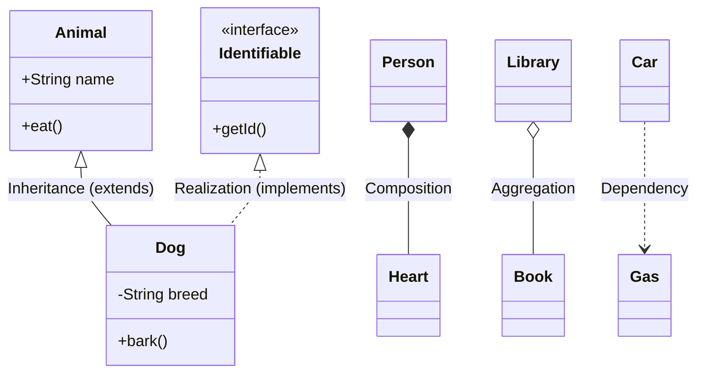

---
# UML Class Diagram Cheat Sheet
---

## 1. Visibility Modifiers

These symbols denote the access level of attributes and methods.

| Symbol | Java Access Modifier | Description |
| --- | --- | --- |
| **`+`** | `public` | Accessible from anywhere. |
| **`-`** | `private` | Accessible only within the class. |
| **`#`** | `protected` | Accessible by subclasses and same package. |
| **`~`** | `default` (package) | Accessible only within the same package. |
| **`/`** | *Derived* | Value is calculated from other attributes. |
| **`_`** | `static` | (Underline) Shared by all instances. |

**Example:**

```text
+ createUser(name: String) : User
- id : String

```

---

## 2. Relationships (The Arrows)

---

### 🔗 UML Relationship Types

| Relationship                       | Symbol                                         | Code Meaning                                         |
| ---------------------------------- | ---------------------------------------------- | ---------------------------------------------------- |
| **Inheritance** *(Generalization)* | Solid line + Hollow Triangle<br><br>`─────▷`   | `extends` — Parent–Child relationship                |
| **Realization** *(Implementation)* | Dashed line + Hollow Triangle<br><br>`- - - ▷` | `implements` — Class implements an Interface         |
| **Association**                    | Solid line<br><br>`──────`                     | Field reference — A **has** B                        |
| **Dependency**                     | Dashed line + Open Arrow<br><br>`- - - >`      | Method parameter / local variable — A **uses** B     |
| **Aggregation**                    | Hollow Diamond<br><br>`◇─────`                 | Weak **Has-A** — Child can exist without Parent      |
| **Composition**                    | Filled Diamond<br><br>`◆─────`                 | Strong **Has-A** — Child cannot exist without Parent |

---

* **Composition vs Aggregation** is one of the **most frequently asked UML questions**
* If lifecycle is **strictly bound → Composition**
* If lifecycle is **independent → Aggregation**


## 3. Multiplicity

Indicates how many instances of one class are linked to the other.

* `1` : Exactly one
* `0..1` : Zero or one (Optional)
* `*` or `0..*` : Zero to many
* `1..*` : One to many

---

## 4. Mermaid.js Template

You can paste this directly into GitHub Markdown files to render a live diagram.




### **Quick Tip for your Readme:**

For the **Singleton** code you pasted earlier, the UML would look like this:

* `User` has a private constructor (`-User()`).
* `User` has a static field of itself (`-static User instance`).
* `User` has a static public method (`+static getInstance()`).

