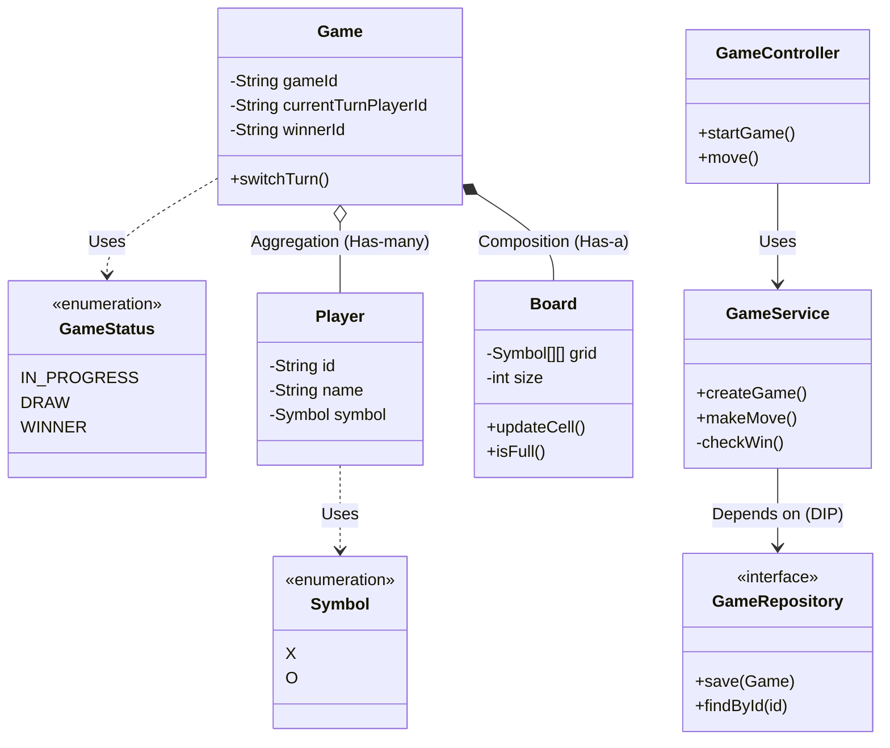
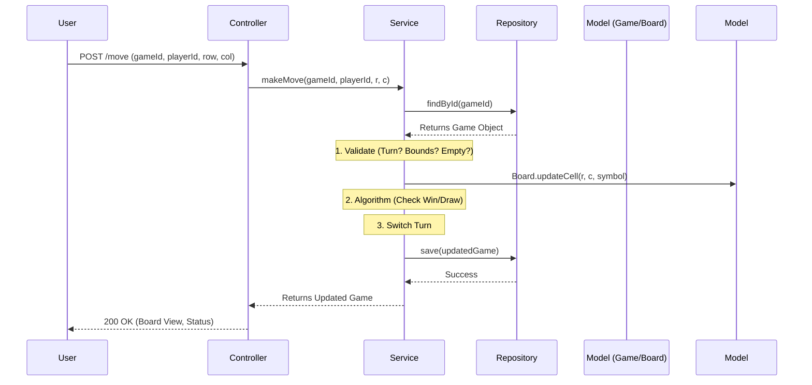

Here is the **Architectural README** (HLD + LLD) tailored for your interview preparation. 

-----

# README: Tic-Tac-Toe System Design (LLD)

## 1\) Rough Flow of Program

1.  **Initialization:** Server starts, initializing Spring Context and the Game Service.
2.  **Game Creation:** User A requests a new game; System creates a `Game` instance with a unique ID, two `Player` objects, and an empty $3\times3$ `Board`.
3.  **Game Loop:**
      * Current player sends a move (Row, Col).
      * **Validation:** System checks bounds, turn order, and if the cell is empty.
      * **Update:** Board is updated; Turn is switched.
      * **Check Status:** System calculates if there is a Winner or Draw after the move.
4.  **Termination:** If a terminal state (Win/Draw) is reached, the game status is updated, and the winner is announced.

-----

## 2\) Functional & Non-Functional Requirements

| Type | Requirements |
| :--- | :--- |
| **Functional** | 1. **Start Game:** Initialize board and players. 2. **Make Move:** Accept coordinates from valid player. 3. **Validation:** Ensure valid moves and correct turn. 4. **Win/Draw Algo:** Check $3\times3$ grid for winning lines. 5. **Game State:** Retrieve board view and status. |
| **Non-Functional** | 1. **Concurrency:** Handle simultaneous games and thread-safe state updates. 2. **Extensibility:** Interface-based storage (easy swap from memory to DB). 3. **Maintainability:** Clean MVC separation. |

-----

## 3\) Entities (Properties & Methods)

| Entity | Properties | Key Responsibilities |
| :--- | :--- | :--- |
| **Player** | `id`, `name`, `symbol` (X/O) | Holds user details. |
| **Board** | `size` ($N$), `grid` ($N\times N$ Matrix) | Manages grid state, initializes cells. |
| **Game** | `gameId`, `board`, `players`, `status`, `winnerId`, `currentTurn` | **Root Aggregate.** Manages game lifecycle, turn switching, and orchestration. |
| **Move** | `playerId`, `row`, `col` | DTO to capture user intent. |

Here are the visual representations of the system design. I have provided both the **Class Diagram** (structural view) and the **MVC Data Flow** (execution view) using Mermaid syntax, which you can draw on a whiteboard during an interview.

### A\. Class Diagram (Structure & Relations)

This diagram highlights the SOLID principles and Object-Oriented relationships (Composition vs. Aggregation).

**Key Interview Talking Points for Class Diagram:**

  * **Composition (`*--`):** `Game` controls the lifecycle of `Board`. If the Game is deleted, the Board is gone.
  * **Aggregation (`o--`):** Players are independent entities. A player can exist even if the specific `Game` instance is destroyed.
  * **Dependency Injection:** `GameService` depends on the `GameRepository` interface, allowing us to swap the storage mechanism easily.

-----

### B\. MVC Data Flow (Execution Path)

This diagram shows how a "Make Move" request travels through the layers.

**Key Interview Talking Points for Data Flow:**

  * **Statelessness:** The Controller is stateless; it just passes data.
  * **Fat Service / Thin Controller:** All validation logic (Is it this player's turn? Is the cell empty?) happens in the Service, not the Controller.
  * **Atomic State:** We fetch the full Game state, modify it in memory, and save it back. This ensures data consistency.

-----

## 4\) Relations (OOP & SOLID Principles)

  * **Composition:** `Game` **has-a** `Board`. The Board cannot exist meaningfully without the Game context.
  * **Aggregation:** `Game` **has** `Players`. Players can exist independently (e.g., in a user profile system) before joining a game.
  * **SRP (Single Responsibility):**
      * `Board`: Only cares about grid data.
      * `GameService`: Only cares about rules and flow.
      * `Controller`: Only cares about HTTP/Input parsing.
  * **DIP (Dependency Inversion):** Service depends on `GameRepository` (Interface), not `InMemoryGameRepository` (Implementation).

-----

## 5\) Design Patterns

  * **Singleton Pattern:** Spring Beans (`Service`, `Controller`, `Repository`) are Singletons by default to save memory.
  * **Repository Pattern:** Abstracts the data layer. Allows switching between In-Memory map and SQL/NoSQL without touching business logic.
  * **Strategy Pattern (Potential):** Can be used for the `WinningStrategy` (e.g., if we switch from $3\times3$ to $N\times N$ or Connect-4 rules), though simple logic is used here for speed.

-----

## 6\) Data Storage Strategy

**Default Implementation:** In-Memory using `ConcurrentHashMap` for $O(1)$ access and thread safety during the interview demo.

**Database Selection (If Persistence is required):**

| DB Type | Recommendation | Reason |
| :--- | :--- | :--- |
| **NoSQL** | **MongoDB** | **Selected.** A Game is a self-contained "Document". The Board (nested array) and Players fit naturally into a JSON structure. Fetching `GameById` retrieves the entire state instantly without complex SQL joins. |
| **RDBMS** | PostgreSQL | Use only if we need complex analytics (e.g., "Find all games won by X in \< 5 moves"). Storing a 2D grid requires serialization or a separate `Cells` table, which adds overhead. |

-----

## 7\) Architecture (MVC)

We follow the standard **Spring Boot MVC** layered architecture:

1.  **Controller Layer (`GameController`):** Entry point. Handles HTTP Requests (`POST /start`, `POST /move`). Maps JSON to DTOs.
2.  **Service Layer (`GameService`):** The "Brain". Handles validation, turn switching, and the Win/Draw algorithm.
3.  **Repository Layer (`GameRepository`):** The "Store". Interface for `save()` and `findById()`.
4.  **Domain Layer (`Game`, `Board`):** POJOs representing the business data.

-----

## 8\) Important Dependencies

| Dependency | Why it is needed? |
| :--- | :--- |
| `spring-boot-starter-web` | Provides the embedded Tomcat server and DispatcherServlet for REST API handling. |
| `lombok` | Removes boilerplate code. Generates Getters, Setters, Constructors, and `toString` automatically via annotations (`@Data`, `@AllArgsConstructor`). Crucial for coding speed in interviews. |

-----

## 9\) Implementation Sequence (Logical Order)

1.  **Define Entities:** Create `Player`, `Board`, and `Game` classes. Use Lombok.
2.  **Define DTOs:** Create Request objects (`ConnectGameRequest`, `GameplayRequest`) to sanitize inputs.
3.  **Create Repository Interface:** Define `save` and `find` contract.
4.  **Implement Repository:** Create `InMemoryGameRepository` using a `Map`.
5.  **Build Service Logic:**
      * Method to create game.
      * Method to execute move (Validation -\> Update Board -\> Check Win -\> Switch Turn).
6.  **Build Controller:** Expose Endpoints connecting to Service.
7.  **Main Method:** Initialize Context, fetch Service bean, and run the `Scanner` loop for the demo.

-----

## 10\) Optimization Ideas

  * **Caching:** Introduce **Redis** to cache `Game` objects. Since game state changes rapidly (every few seconds), reading from memory (Redis) is faster than hitting a disk-based DB.
  * **Concurrency:** Use `Optimistic Locking` (`@Version` in JPA or equivalent in Mongo) if two players try to move simultaneously, though the turn-based nature mitigates this.
  * **Communication:** Upgrade from REST (Request-Response) to **WebSockets** (STOMP protocol) so players receive board updates instantly without polling the server.

-----
